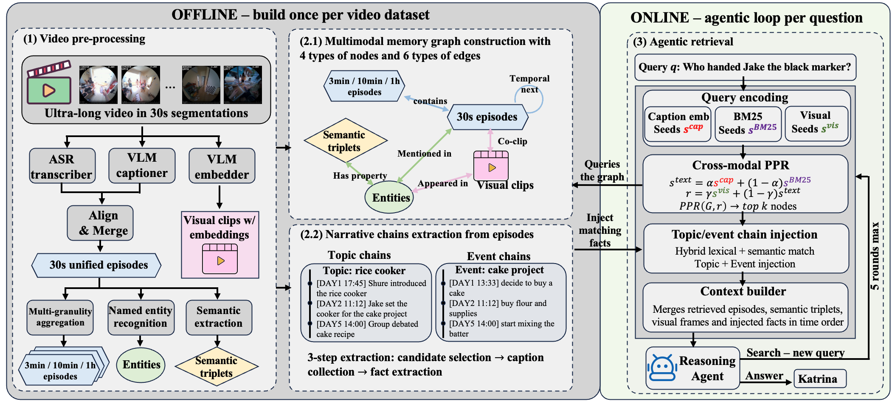
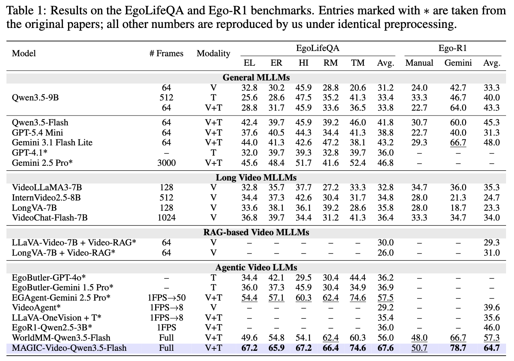
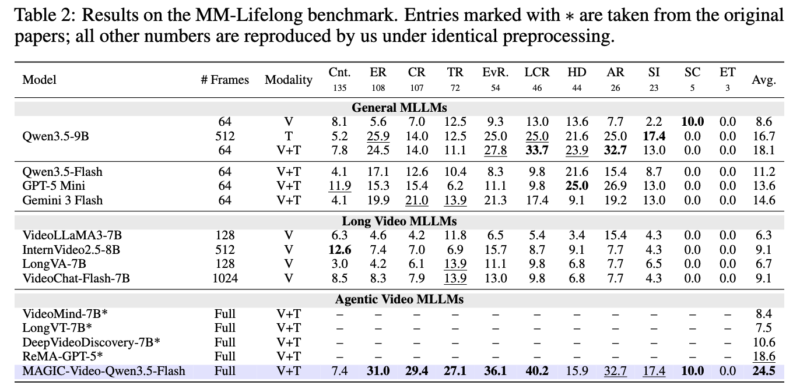

# MAGIC-Video

> **MAGIC-Video** is a training-free framework for ultra-long video reasoning (days to weeks of footage) built around a **M**ultimod**A**l memory **G**raph with **I**nterleaved narrative **C**hain. The **Multimodal Memory Graph (MMG)** unifies episodic captions, named entities, semantic triples, and visual clips into a single heterogeneous graph connected by six typed cross-modal and temporal edges, supporting cross-modal retrieval via a single Personalized PageRank pass. The **Narrative Memory Chain (NMC)** complements bottom-up graph aggregation with a top-down distillation that scans the whole video offline to surface per-entity biographies and multi-day activity events as coherent cross-time threads. At inference time, an agentic loop alternates between search and answer, interleaving graph retrieval with narrative fact injection — covering both the modality and time dimensions of ultra-long video in a single retrieval pipeline.

On three ultra-long video benchmarks, MAGIC-Video outperforms the strongest prior agentic systems by **+10.1** points on **EgoLifeQA**, **+7.4** points on **Ego-R1**, and **+5.9** points on **MM-Lifelong**.

<p align="center">
  
</p>
<p align="center"><em>Method overview. Offline (left): video → multi-granularity captions → Multimodal Memory Graph (MMG) and Narrative Memory Chains (NMC). Online (right): an agentic loop alternates cross-modal PPR over MMG with narrative fact injection from NMC into the model context.</em></p>

---

## 1. Installation

```bash
git clone https://github.com/lijiazheng0917/MAGIC-video.git
cd MAGIC-video

# Environment
uv sync
source .venv/bin/activate

# Python path (required for every shell that runs eval/preprocess)
export PYTHONPATH=$PWD/src/EgoRAG:$PWD/src:${PYTHONPATH:-}
```

### API keys

All LLM calls go through OpenRouter. Export before running anything:

```bash
export OPENROUTER_API_KEY=<your-openrouter-key>
```

Default models used throughout the paper:

| Role | Model | Source |
|---|---|---|
| Retriever | `openai/gpt-oss-120b` | OpenRouter |
| Responder | `qwen/qwen3.5-flash-02-23` | OpenRouter |
| MM-Lifelong judge | `openai/gpt-5` (main) / `qwen/qwen3.5-flash-02-23` / `openai/gpt-5-mini` | OpenRouter |
| Text embedding | `Qwen/Qwen3-Embedding-4B` | Hugging Face (local, GPU) |

The text embedding model runs locally — weights are fetched from Hugging Face on first use. You can substitute any OpenRouter-compatible LLM or any Hugging Face sentence-embedding model via the CLI flags shown below.

### Optional: open-source VLM baselines

Reproducing the open-source VLM rows in the paper (Qwen3.5-9B, VideoLLaMA3, InternVideo2.5, LongVA, VideoChat-Flash) uses `vllm` and is **not covered by `uv sync`** — `vllm` has a different CUDA / PyTorch stack that conflicts with our main environment. Create a separate conda env for it:

```bash
conda create -n worldmm_vllm python=3.11 -y
conda activate worldmm_vllm
pip install vllm transformers accelerate
# plus the baseline-specific requirements, see baselines/eval/*.py
```

See [`baselines/README.md`](baselines/README.md) for per-model reproduction instructions. If you only care about reproducing **our** numbers (not the baselines), you can skip this.

### Compute requirements

Each command below is annotated with its resource needs:

| Tag | Meaning |
|---|---|
| `[API]` | OpenRouter calls only; runs on any CPU machine |
| `[GPU]` | Loads a local model (Whisper / VLM2Vec / Qwen-Embedding); needs an NVIDIA GPU |
| `[GPU + API]` | Both |
| `[Local]` | Pure file I/O / text processing; no GPU, no API |

All `[GPU]` steps in the paper were run on a single NVIDIA A100 (40 GB).

### Skipping preprocessing

All `[API]` steps produce JSON artifacts (captions, OpenIE results, semantic triples, topic/storyline chains). They cost OpenRouter credits and take several hours per subject / video, and because LLM outputs are non-deterministic, re-running them will give slightly different results from ours. To make reproduction both cheap and faithful, we will release the exact artifacts used in the paper on Hugging Face (link TBD). Once downloaded, you only need to run the `[GPU]` steps (visual embeddings + unified graph) and then go straight to evaluation.

In contrast, `[GPU]` steps are deterministic given the same inputs and model weights, so we do **not** ship them — you rebuild them locally with the commands below.

---

## 2. EgoLifeQA (500q MCQ)

Subject used in the paper: `A1_JAKE` (7 days, ~50h of egocentric video).

### 2.1 Download `[Local]`

```bash
hf download lmms-lab/EgoLife --repo-type=dataset --local-dir data/EgoLife
```

### 2.2 Preprocess captions

```bash
# [API] Translate dense captions (CN → EN)
python data/EgoLife/utils/translate_densecap.py
# [Local] Align translated captions with transcripts
python data/EgoLife/utils/generate_sync.py
```

### 2.3 Extract memory features
```bash
# [API] Episodic memory: 30sec captions → multiscale → triples
python preprocess/egolife/episodic/generate_fine_caption.py \
    --sync-dir data/EgoLife/EgoLifeCap/Sync \
    --output data/EgoLife/EgoLifeCap/A1_JAKE/A1_JAKE_30sec.json
python -m worldmm.memory.episodic.multiscale \
    --db_name A1_JAKE \
    --json_path data/EgoLife/EgoLifeCap/A1_JAKE/A1_JAKE_30sec.json \
    --diary_dir .cache/events_diary \
    --save_path data/EgoLife/EgoLifeCap
python preprocess/egolife/episodic/extract_episodic_triples.py --subject A1_JAKE

# [API] Semantic memory triples
python preprocess/egolife/semantic/extract_semantic_triples.py --subject A1_JAKE
# [GPU + API] Consolidation (loads Qwen3-Embedding-4B for clustering + LLM for canonicalization)
python preprocess/egolife/semantic/consolidate_semantic_memory.py --subject A1_JAKE

# [GPU] Visual memory (VLM2Vec embeddings, single GPU)
CUDA_VISIBLE_DEVICES=0 python preprocess/egolife/visual/extract_visual_features.py --subject A1_JAKE --num_frames 16
# Multi-GPU alternative: bash preprocess/egolife/visual/extract_visual_features.sh --subject A1_JAKE --gpu 0,1,2,3 --num_frames 16
```

### 2.4 Build unified multimodal graph `[GPU]`

```bash
python preprocess/build_unified_graph.py \
    --dataset egolife --subject A1_JAKE \
    --embedding-model Qwen/Qwen3-Embedding-4B \
    --embedding-device cuda
```

### 2.5 Build temporal augmentation `[API]`

```bash
python preprocess/egolife/extract_topic_chains.py \
    --subject A1_JAKE \
    --model openai/gpt-oss-120b \
    --output-dir output/metadata/topic_chains

python preprocess/egolife/extract_storylines.py \
    --subject A1_JAKE \
    --model openai/gpt-oss-120b \
    --output-dir output/metadata/storylines
```

### 2.6 Evaluate `[GPU + API]`

```bash
python eval/eval_egolife.py \
    --subject A1_JAKE \
    --retriever-model openai/gpt-oss-120b \
    --respond-model qwen/qwen3.5-flash-02-23 \
    --chain-mode facts \
    --topic-chain-facts-path output/metadata/topic_chains/A1_JAKE/topic_chains.json \
    --storyline-path output/metadata/storylines/A1_JAKE/step3_enriched_chains.json \
    --parallel 8
```

Chain hyperparameters use paper defaults (W4: `--chain-max-events 1 --chain-topic-sim 0.7 --chain-storyline-sim 0.7`). For the baseline (independent three-way retrieval), pass `--retrieval-backend independent --chain-mode ""`.

---

## 3. Ego-R1 (50q MCQ)

Ego-R1 reuses the EgoLife memory and graph — only the benchmark file differs.

### 3.1 Get the benchmark

Place the two split files at:
- `data/Ego-R1-Bench/manual-benchmark/A1_JAKE.json`
- `data/Ego-R1-Bench/gemini-benchmark/A1_JAKE.json`

See the Ego-R1 paper for download instructions.

### 3.2 Evaluate `[GPU + API]`

```bash
python eval/eval_egor1.py \
    --subject A1_JAKE \
    --retriever-model openai/gpt-oss-120b \
    --respond-model qwen/qwen3.5-flash-02-23 \
    --chain-mode facts \
    --topic-chain-facts-path output/metadata/topic_chains/A1_JAKE/topic_chains.json \
    --storyline-path output/metadata/storylines/A1_JAKE/step3_enriched_chains.json
```

Chain hyperparameters use paper defaults (X3: `--chain-max-events 1 --chain-topic-sim 0.7 --chain-storyline-sim 0.7`). Baseline: pass `--retrieval-backend independent --chain-mode ""`.

---

## 4. MM-Lifelong (623q open-ended)

### 4.1 Download (14 videos — full coverage of the 623 val questions) `[Local]`

```bash
hf download CG-Bench/MM-Lifelong \
    month/4.mp4 month/11.mp4 month/12.mp4 month/13.mp4 \
    month/14.mp4 month/15.mp4 month/16.mp4 month/17.mp4 \
    month/18.mp4 month/19.mp4 month/20.mp4 month/21.mp4 \
    month/22.mp4 month/23.mp4 \
    --repo-type dataset --local-dir data/MM-Lifelong
```

For a quick-start subset you can download fewer videos (each covers a disjoint slice of questions):

| Subset | IDs | Questions covered |
|---|---|---|
| top3 | `14,19,18` | 222 / 623 (35.6%) |
| top5 | `14,19,18,21,17` | 336 / 623 (53.9%) |
| top7 | `14,19,18,21,17,23,22` | 442 / 623 (70.9%) |
| **all (paper)** | `4,11,12,13,14,15,16,17,18,19,20,21,22,23` | 623 / 623 (100%) |

### 4.2 Per-video preprocessing

For each broadcast `$vid`, run the full pipeline (ASR → VLM caption → merge → multi-scale → OpenIE → semantic → visual embeddings) in one command `[GPU + API]`:

```bash
python preprocess/mmlifelong/preprocess_video.py \
    --video-id $vid \
    --whisper-model large-v3-turbo \
    --llm-model openai/gpt-oss-120b
```

The script writes checkpoints after each stage, so reruns skip finished work.

<details>
<summary>Split into separate stages (optional, for HPC or to separate GPU vs API workloads)</summary>

```bash
# [GPU] Whisper ASR
python preprocess/mmlifelong/preprocess_video.py --video-id $vid --caption-mode asr \
    --skip-openie --skip-semantic --skip-visual

# [API] VLM caption via OpenRouter
python preprocess/mmlifelong/preprocess_video.py --video-id $vid --caption-mode vlm \
    --skip-whisper --skip-openie --skip-semantic --skip-visual

# [API] Merge ASR + VLM into multi-scale captions
python preprocess/mmlifelong/preprocess_video.py --video-id $vid --caption-mode merge \
    --skip-whisper --skip-vlm --skip-openie --skip-semantic --skip-visual

# [GPU + API] OpenIE + semantic extraction + consolidation
python preprocess/mmlifelong/preprocess_video.py --video-id $vid --caption-mode merge \
    --skip-whisper --skip-vlm --skip-captions --skip-visual

# [GPU] VLM2Vec visual embeddings
python preprocess/mmlifelong/preprocess_video.py --video-id $vid \
    --skip-whisper --skip-vlm --skip-captions --skip-openie --skip-semantic
```
</details>

### 4.3 Build unified graph (per video) `[GPU]`

```bash
python preprocess/build_unified_graph.py \
    --dataset mmlifelong \
    --video-id $vid \
    --embedding-model Qwen/Qwen3-Embedding-4B \
    --embedding-device cuda
```

### 4.4 Build temporal augmentation (per video) `[API]`

```bash
python preprocess/mmlifelong/extract_topic_chains.py --video-id $vid --model openai/gpt-oss-120b
python preprocess/mmlifelong/extract_storylines.py  --video-id $vid --model openai/gpt-oss-120b
```

### 4.5 Evaluate `[GPU + API]`

```bash
python eval/eval_mmlifelong.py \
    --retriever-model openai/gpt-oss-120b \
    --respond-model qwen/qwen3.5-flash-02-23 \
    --chain-mode facts \
    --parallel 8
```

The chain hyperparameters default to the paper's tuned config F5 (`min-hits 4 / topic-sim 0.7 / storyline-sim 0.7 / max-topics 2 / max-events 2 / storyline-min-hits 1 / storyline-granularities "30sec,3min"`). Baseline: pass `--retrieval-backend independent --chain-mode ""`.

### 4.6 Re-judge with a different LLM `[API]`

```bash
python eval/rejudge.py \
    --input <results.json> \
    --output <results_judged_flash.json> \
    --judge-model qwen/qwen3.5-flash-02-23 \
    --parallel 8
```

---

## 5. Main Results (paper defaults)

<p align="center">
  
</p>
<p align="center"><em>Main results across EgoLifeQA, Ego-R1 and MM-Lifelong; rows correspond to the model categories reported in the paper.</em></p>

<p align="center">
  
</p>
<p align="center"><em>MM-Lifelong per-question-type breakdown.</em></p>

See the paper for ablations, judge-comparison tables, and chain-injection breakdown.

---

## 6. Acknowledgments

Built on [WorldMM](https://github.com/wgcyeo/WorldMM), [HippoRAG](https://github.com/OSU-NLP-Group/HippoRAG), and [VLM2Vec](https://github.com/TIGER-AI-Lab/VLM2Vec). Datasets: [EgoLife](https://huggingface.co/datasets/lmms-lab/EgoLife) (LMMs-Lab), [Ego-R1](https://huggingface.co/datasets/Ego-R1/Ego-R1-Data), [MM-Lifelong](https://huggingface.co/datasets/CG-Bench/MM-Lifelong) (CG-Bench).


